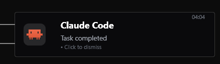

# ClaudeCodeNotifyBeacon

A premium Dynamic Island-style desktop notification pill for [Claude Code](https://claude.ai/code). Built with WPF for hardware-accelerated rendering, featuring the official Claude brand icon with correct SVG rendering and Windows 11 native rounded corners.



## Features

- **Dynamic Island pill** — 400×90 custom WPF floating window, CornerRadius 16, drop shadow
- **Zero-latency daemon** — WPF assemblies pre-loaded in a persistent background process; pill appears within 250ms of task completion
- **Official Claude SVG icon** — SVG-parsed brand logo with correct EvenOdd fill-rule via `GeometryDrawing`
- **Windows 11 native rounded corners** — DWM API (`DWMWCP_ROUNDSMALL`) for true rounded window edges
- **GPU-accelerated Storyboards** — entrance (250ms scale+fade), auto-dismiss (350ms fade after 30s), click dismiss (150ms fade)
- **Dynamic task context** — reads hook stdin JSON to show real task summaries in the pill body
- **Debounce** — 90s lock file prevents duplicate notifications

## Why ClaudeCodeNotifyBeacon?

Most Claude Code notification projects for Windows use `[Windows.UI.Notifications]` toast messages — the standard system popup in the bottom-right corner. ClaudeCodeNotifyBeacon takes a different approach:

| Feature | ClaudeCodeNotifyBeacon | Toast-based notifiers |
|---|---|---|
| **Rendering** | Custom WPF floating window | System toast API |
| **Design** | Dynamic Island pill with brand icon | Standard Windows notification |
| **Icon** | Official Claude SVG (EvenOdd fill) | N/A or raster fallback |
| **Rounded corners** | DWM native (Win32 level) | System-determined |
| **Latency** | ~250ms (pre-warmed daemon) | Varies (PowerShell cold start) |
| **Dismiss** | Click 150ms fade + 30s auto-fade | System-managed |
| **GPU accelerated** | Yes (WPF Storyboard) | No |
| **Architecture** | Daemon + trigger file | Direct PowerShell call |

ClaudeCodeNotifyBeacon is the only project that renders a custom floating WPF pill with the official Claude brand SVG using correct EvenOdd geometry — because a premium AI tool deserves a premium notification.

## Requirements

- Windows 10 or 11
- PowerShell 5.1 (built-in)
- [Claude Code](https://docs.anthropic.com/en/docs/claude-code)

## Quick Start

### 1. Clone or download

```powershell
git clone https://github.com/Junyi-Tang/ClaudeCodeNotifyBeacon.git
# or just download notify.ps1, notify-daemon.ps1, and assets/
```

### 2. Configure the hook

Add to your Claude Code settings (`~/.claude/settings.json` or project `.claude/settings.json`):

```json
{
  "hooks": {
    "Notification": [
      {
        "matcher": "",
        "hooks": [
          {
            "type": "command",
            "command": "powershell -ExecutionPolicy Bypass -File \"C:\\Users\\YOURNAME\\path\\to\\ClaudeCodeNotifyBeacon\\notify.ps1\""
          }
        ]
      }
    ]
  },
  "preferredNotifChannel": "notifications_disabled"
}
```

### 3. Start the daemon

```powershell
Start-Process powershell -WindowStyle Hidden -ArgumentList @(
    "-NoProfile", "-ExecutionPolicy", "Bypass", "-STA",
    "-File", """C:\Users\YOURNAME\path\to\ClaudeCodeNotifyBeacon\notify-daemon.ps1"""
)
```

The daemon stays running in the background. Start it once per login session.

### 4. Test

```powershell
"Test notification" | Out-File -FilePath "$env:TEMP\claude_notify_trigger.txt" -Encoding utf8 -Force
```

## How It Works

```
┌─────────────┐     ┌──────────────┐     ┌──────────────────┐
│ Claude Code │ ──▶ │  notify.ps1   │ ──▶ │ notify-daemon.ps1│
│ Notification│     │ sound + write │     │ WPF pill on      │
│ hook fires  │     │ trigger file  │     │ screen 30s       │
└─────────────┘     └──────────────┘     └──────────────────┘
                           ~10ms               ~250ms poll
```

1. Claude Code finishes a task → `Notification` hook fires
2. `notify.ps1` runs: debounce check → plays system chime → writes trigger file → exits
3. `notify-daemon.ps1` (persistent background process with WPF pre-loaded) detects the trigger within 250ms → renders the Dynamic Island pill instantly

## File Structure

```
ClaudeCodeNotifyBeacon/
├── notify.ps1               # Hook entry point (trigger writer)
├── notify-daemon.ps1        # Persistent notification daemon (WPF)
├── assets/
│   └── claudecode-color.svg # Official Claude Code brand icon
└── README.md
```

## License

MIT
